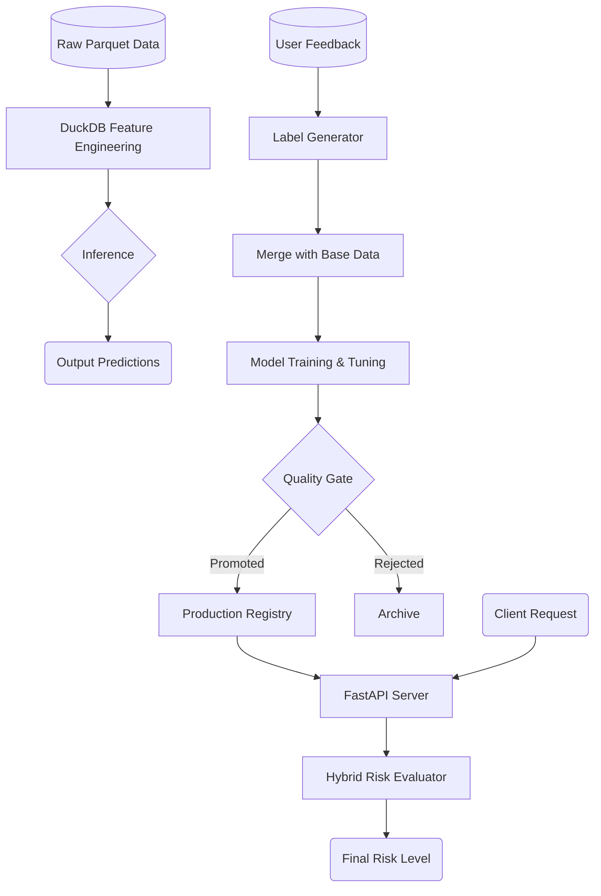

<div align="center">
  <h1>MLOps Spam Phone Detection</h1>
  <p><i>An end-to-end MLOps pipeline and API service for real-time spam phone number detection.</i></p>

  [](https://python.org) [](https://fastapi.tiangolo.com) [](https://xgboost.readthedocs.io/) [](https://mlflow.org/) [](https://duckdb.org/)
</div>

---

## Overview

This project provides a robust, production-ready **MLOps ecosystem** to detect spam phone calls. It automatically processes raw telecommunication logs, extracts meaningful features using DuckDB, trains gradient boosting models (XGBoost) with hyperparameter tuning (Optuna), evaluates risk using a hybrid rule-engine, and serves predictions via a high-performance REST API.

## Key Features

- **Automated MLOps Pipeline:** Fully automated data ingestion, inference, user-feedback labeling, and model retraining.
- **Hybrid Risk Evaluation:** Combines XGBoost probabilities with heuristic business rules (blacklists, call duration thresholds, prefix risk scoring) to assign actionable risk levels (0-4).
- **Experiment Tracking:** Integrated with **MLflow** to track hyperparameters, metrics (AUC, F1), and model artifacts automatically.
- **Quality Gates & Auto-Promotion:** Candidates are evaluated against the current production model and automatically promoted if their F1/AUC delta exceeds predefined thresholds.
- **Blazing Fast Feature Engineering:** Utilizes **DuckDB** for out-of-memory SQL transformations directly on Parquet files.
- **Production-Ready API:** FastAPI service with Swagger UI for serving predictions and processing risk evaluations in real-time.

## Architecture & Workflow




## Getting Started

### 1. Local Installation

```bash
# Clone the repository
git clone <repository_url>
cd mlops_spam_phone

# Create virtual environment and install dependencies
python3 -m venv .venv
source .venv/bin/activate
pip install -r requirements.txt
```

### 2. Configuration

All operational configurations are managed via YAML files in the `configs/` directory.

- `pipeline.yaml`: Controls data paths, tuning parameters, and model promotion thresholds.
- `risk_config.yaml`: Defines heuristic rules, score thresholds, and whitelist adjustments.
- `external_data.yml`: Phone prefixes and metadata for feature engineering.

*Note: Ensure your input parquet files are placed in `data/input/` as defined in `pipeline.yaml`.*

## Usage

### Command Line Interface (CLI)

The project includes a unified CLI to trigger pipeline steps manually.

```bash
# Run the complete end-to-end pipeline
python -m src.cli pipeline

# Or run individual steps:
python -m src.cli infer     # 1. Run predictions on new data
python -m src.cli label     # 2. Process user feedback
python -m src.cli dataset   # 3. Build training dataset
python -m src.cli train     # 4. Train, tune, and evaluate new model
```

### Serving the API

Start the FastAPI application to serve predictions and evaluate risk:

```bash
python scripts/run_api.py
```
*API Docs: Visit `http://localhost:8000/docs` to interact with the Swagger UI.*

**Example Request:** Evaluate a phone number's risk.
```bash
curl -X 'POST' \
  'http://localhost:8000/evaluate/risk' \
  -H 'Content-Type: application/json' \
  -d '{
  "phone": "0912345678",
  "model_score": 0.85,
  "features": {
    "prefix": "091",
    "is_international": false,
    "total_call": 15,
    "miss_call": 12,
    "avg_duration": 4.5,
    "frequency_per_day": 10.0,
    "callback_rate": 0.05,
    "mostly_out_of_business_hour": true,
    "in_contact": false,
    "successful_call_count": 0,
    "avg_in_duration": 0
  }
}'
```

### MLflow Tracking Dashboard

To visualize model metrics, hyperparameter tuning results, and artifacts:

```bash
mlflow ui --port 5000
```
Then navigate to `http://localhost:5000`.

## Testing

The project includes a robust test suite covering core utilities, ML pipeline components, the risk engine, and API endpoints.

```bash
# Run all tests
python -m unittest discover -s tests -p "test_*.py" -v
```

## Docker Deployment

A multi-stage `Dockerfile` is provided for optimized production deployments.

```bash
# Build the Docker image
docker build -t mlops-spam-api .

# Run the containerized service
docker run -d -p 8000:8000 --name spam-api mlops-spam-api
```
